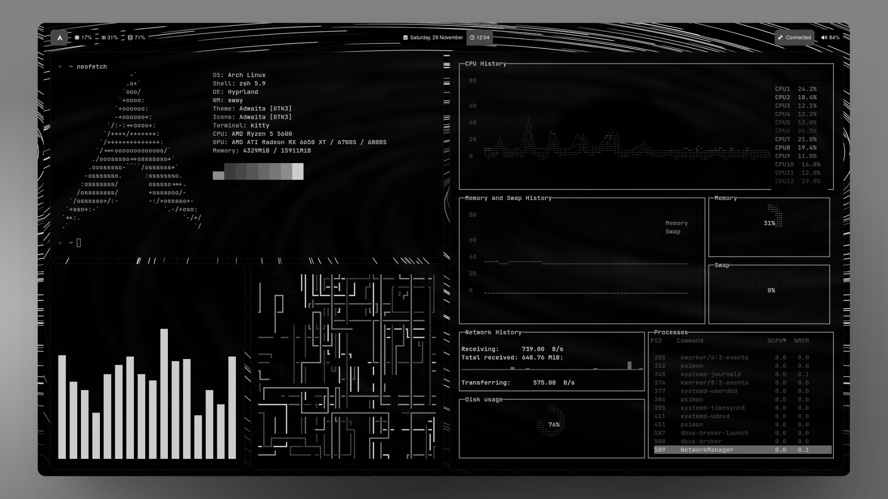

<p align="center">
  Minimalist <b>Hyprland</b> setup. Automated with <b>Dotbot</b>.
</p>

<div align="center">
  
</div>

## 🛠️ The Stack

- **Window Manager:** Hyprland
- **Terminal:** Kitty + Tmux (TPM)
- **Shell:** Zsh + Spaceship
- **Editor:** Neovim
- **Theme:** Pywal + Waypaper
- **Utils:** Waybar, SwayNC, Lazygit, K9s
- **Extra:** Hyprpicker, Hyprshot

## ⌨️ Keybinds

| Key                 | Action                        |
| :------------------ | :---------------------------- |
| **ALT + Shift + R** | Reload Waybar                 |
| **ALT + F12**       | Color Picker (Hyprpicker)     |
| **ALT + W**         | Random Wallpaper              |
| **ALT + Shift + W** | Wallpaper Selector (Waypaper) |
| **ALT + Shift + S** | Screenshot Region (Clipboard) |
| **ALT + Shift + N** | Notification Center           |

## 🚀 Installation

**1. Dependencies** (Arch Linux example)

```bash
sudo pacman -S git python hyprland kitty tmux neovim zsh waybar swaync lazygit hyprpicker hyprshot
```

**2. Clone & Install**

```bash
# Clone with recursive flag for Dotbot
git clone --recursive https://github.com/Niwau/dotfiles ~/dotfiles

# Run installer
cd ~/dotfiles && ./install
```

**3. Finish Up**

- **Tmux:** Open `tmux` and press `Prefix + I` to fetch plugins.
- **Zsh:** Set as default: `chsh -s $(which zsh)`.

## 📂 Structure

Files in `config/` are automatically symlinked to `~/.config/`.

```text
~/dotfiles/
├── config/        # -> ~/.config/ (Hyprland, Nvim, Tmux...)
├── .zshrc         # -> ~/.zshrc
├── install        # Installation script
└── install.conf.yaml
```
